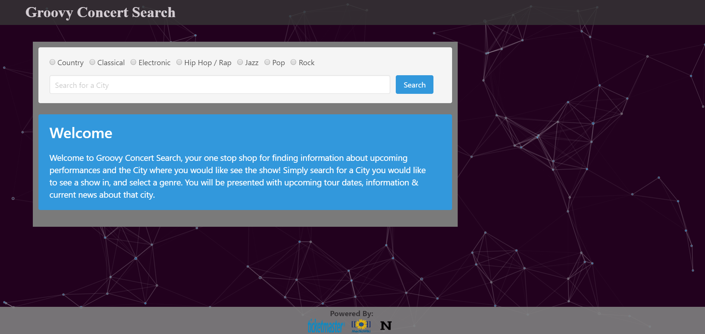
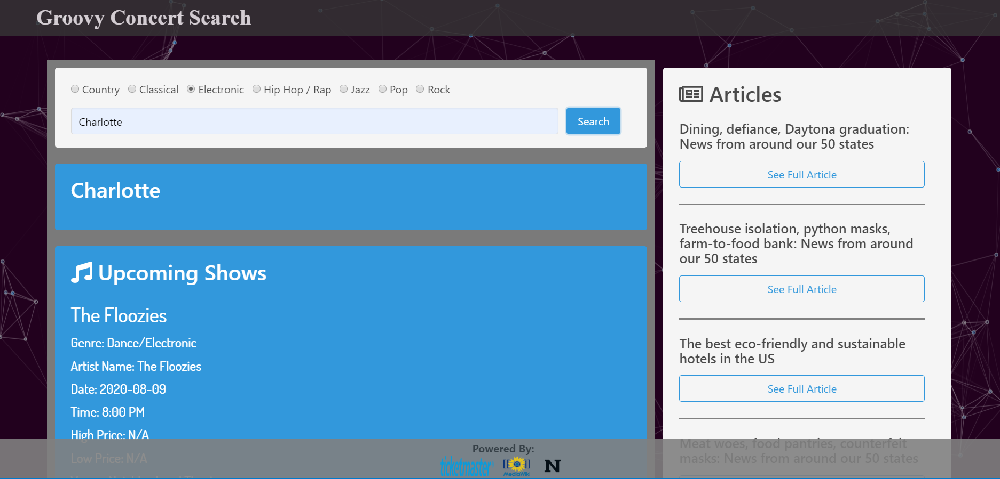

# Groovy Concert Search

## Description
Groovy Concert Search takes the hassle out of planning your next concert or festival trip. Instead of visiting multiple websites to buy tickets, book a room, find local restaurants, etc. This site allows users to complete all their concert planning needs from one location. 

## Table of Contents
* [Deployed Application](#Deployed)
* [Images](#Images)
* [Usage](#Usage)
* [Collaborators](#Collaborators)
* [Technologies](#Tech)
* [Questions](#Questions)

## Deployed Application
[Groovy Concert Search](https://andrewpaulgreer.github.io/Project1/)

## Images

## Usage
To plan your next concert trip simply navigate to the website, select a genre of music and input the city where you would like to see a show. Once you hit search you will be shown a list of upcoming concerts, info about the city and local news about the cities food and dining. 

## Collaborators
* [Andrew Greer](https://github.com/andrewpaulgreer)
* [Brett Rushing](https://github.com/Brushing1215)
* [Travis Latta](https://github.com/tlatta13)

## Technologies
* Bulma CSS
* Javascript
* Particles.js
* Moment.js
* Ticketmaster API
* MediaWiki API
* NewsAPI

## Questions
If you have any questions, please open an issue, or contact any of the collaborators!

